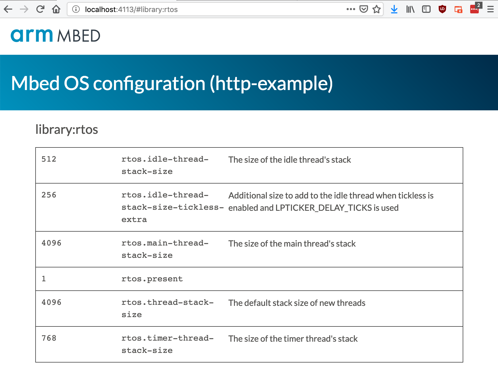

# Visual configuration for Mbed OS

Proof of concept. Adds a visual interface for managing configuration for Mbed OS projects.



## Installation

1. Install a recent version of Node.js.
1. Clone this library:

    ```
    $ git clone https://github.com/janjongboom/mbed-config
    ```

1. Install the library:

    ```
    $ cd mbed-config
    $ npm install
    $ npm install . -g
    ```

1. From an Mbed OS 5 application, run:

    ```
    $ mbed-config
    ```

1. Open a web browser and navigate to http://localhost:4113 to see the configuration screen.

Note that when you edit a configuration option this will overwrite your mbed_app.json file.
