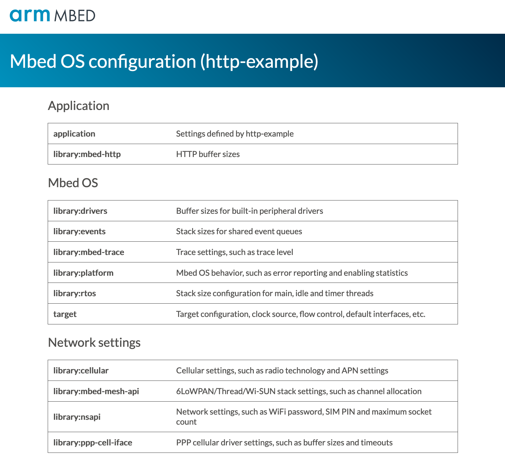

# Visual configuration for Mbed OS

Proof of concept. Mbed OS uses a system where configuration is stored in the `mbed_app.json` file. This configuration file contains application settings, but can also override OS and library settings. Whilst this is great, and adds a lot of flexibility it's not always clear which configuration options are available (because they're spread around in `mbed_lib.json` files), and the values might change per compiler target. This tool adds a visual interface for managing the configuration of Mbed OS projects. It shows a list of available options, split per library, with descriptions of available settings. When editing values these are automatically written back to your `mbed_app.json` file.

## Screenshots

Library overview:



Library settings for the `rtos` library, allowing you to configure the stack sizes of the application:


## Installation

1. Install a recent version of [Node.js](https://nodejs.org/en/).
1. Clone this library:

    ```
    $ git clone https://github.com/janjongboom/mbed-config
    ```

1. Install the library:

    ```
    $ cd mbed-config
    $ npm install
    $ npm install . -g
    ```

1. From an Mbed OS 5 application, run:

    ```
    $ mbed-config -m YOUR_TARGET -t GCC_ARM
    ```

1. Open a web browser and navigate to http://localhost:4113 to see the configuration screen.

Note that when you edit a configuration option this will overwrite your mbed_app.json file!

## License

Apache 2.0, see [LICENSE](LICENSE).
